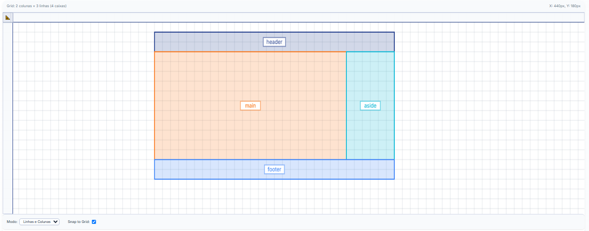

# Projeto: Grid Template (RevCode)

Bem-vindo ao repositório público do projeto **Grid Template**, desenvolvido como parte do RevCode!

Este projeto é um template (ou exemplo) focado na demonstração de layouts utilizando o sistema de **CSS Grid**. Ele foi desenvolvido para ser uma base ou uma referência de como estruturar interfaces web de forma responsiva e eficiente.

## 🚀 Acesse o Site Online

Para explorar o projeto em funcionamento e nos ajudar com seu feedback, acesse a versão publicada:

[**Acessar o Grid Template (RevCode) no Netlify**](https://cozy-capybara-baefc0.netlify.app/)

## 💡 Como Testar e Dar Feedback

Sua opinião é muito importante para nós! Pedimos que você explore o site e nos diga o que achou.

Para enviar seu feedback, siga estas etapas:

1. **Navegue pelo Site**: Clique nos elementos, redimensione a janela do navegador para testar a responsividade, e veja como o layout se comporta em diferentes tamanhos de tela.

2. **Envie seu Feedback**:

   - **Abra uma Issue no GitHub**: Esta é a forma preferida para reportar bugs, sugerir melhorias ou fazer perguntas. Vá para a aba [**Issues deste repositório**](https://github.com/EmersonRomana/grid-template-revcode/issues) e clique em "New issue". Descreva o problema ou sugestão da forma mais detalhada possível.

   - Se preferir, entre em contato direto (coloque aqui seu email ou outro canal se desejar, ex: `seu.email@exemplo.com`).

Agradecemos imensamente sua colaboração para tornar este template ainda melhor!

## 🛠️ Tecnologias Utilizadas

Este projeto foi construído primariamente com:

- **HTML5**: Para a estrutura e conteúdo da página.

- **CSS3**: Especialmente para o layout com CSS Grid e estilização.

- **JavaScript**: Para interatividade.

## 🖼️ Configuração da Grade

Aqui você poderá visualizar a representação visual da estrutura de grid utilizada neste projeto. Esta imagem ajuda a entender a organização das linhas e colunas no layout.

![Imagem da Configuração da Grade]
![Imagem da Configuração da Grade]

_(Aguardando a inclusão da imagem da configuração da grade aqui)_

## 🧩 Gerador de Código para Grid

Este projeto visa aprimorar a criação de layouts com CSS Grid. Para auxiliar no processo, estamos explorando a possibilidade de integrar ou recomendar um **gerador de código CSS Grid**.

Tal ferramenta permitiria aos usuários:

- **Visualizar** diferentes arranjos de grid.

- **Gerar** o código CSS correspondente para `grid-template-columns`, `grid-template-rows`, `grid-gap` e outras propriedades.

- **Facilitar** a experimentação e prototipagem rápida de layouts baseados em grid.

Fique atento para futuras atualizações ou recomendações de ferramentas que possam ajudar você a construir seus próprios grids!

## 🔒 Status do Projeto e Contribuições

Este projeto é atualmente **privado** e não está aberto para `forks` ou contribuições diretas (Pull Requests) no momento.

No entanto, continuamos buscando ativamente seu feedback através das **Issues** do GitHub, conforme detalhado acima. Sua colaboração em testes e sugestões é fundamental!

Um abraço,

**Emerson Romana**
